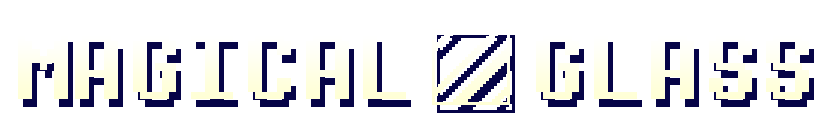

# Magical Glass v1.1.0 for [Kristal](https://github.com/KristalTeam/Kristal)

Adds **UNDERTALE** battles (and more!) to Kristal!

## This library adds...
* UNDERTALE battles (obviously) in the light (and optionally dark) world!
* All of UNDERTALE's weapons and armors!
* Functionality for Spells and TP!
* A Froggit encounter!
* ...And (hopefully) more!

## Planned features/extensions:
* Multiple party members in battles
* Deltatraveler battle system (we have permission, don't worry)
  * Mini party members
* EN and other stuff from GAMETEST_7 (maybe)
* UNDERTALE enemy recreations
* UNDERTALE movement
* UNDERTALE shops

## Credits:

### Lead:
* Sam Deluxe

### Programmers:
* Sam Deluxe (like, everything)
* Nyako (made the basics and dust code)
* bor (assistant, map recreations)
* Just Another Random User (assistant)

## Contributors:
* FireRainV

### Testers:
* Racckoon

### Emotional Support <3:
* Lots of people from the Kristal Discord and its subcommunities
* Eli
* Danny
* Juell
* Nathan
* Trihan
* Garon
* Rachel
* Cris
* skysakura
* NVI
* Welt
* Lynel
* Star Artsy
* Techno

### Programming Assistance:
* Kristal Team

### Sound Effects and Music:
* UNDERTALE Team
* deltarune Team

## Releases:
https://github.com/Idunno1/magical-glass/releases 
(I recommend cloning the repo but y'know)

## Docs:
I'll make these eventually lmao
